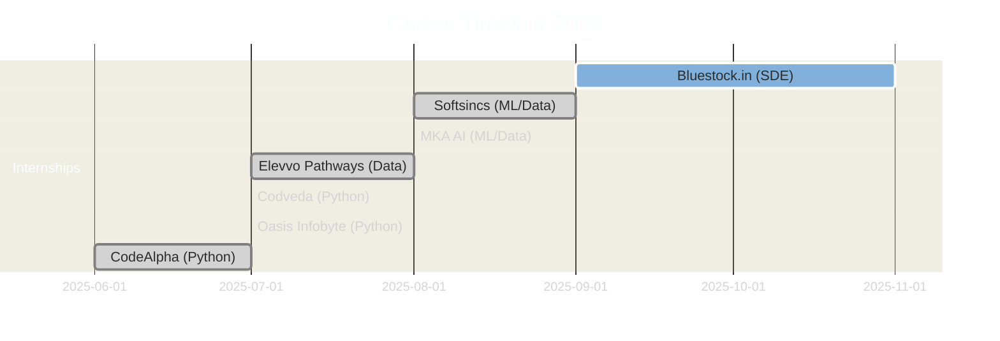

<div align="center">

<!-- Snake Animation -->
<picture>
  <source media="(prefers-color-scheme: dark)" srcset="https://raw.githubusercontent.com/platane/snk/output/github-contribution-grid-snake-dark.svg" />
  <source media="(prefers-color-scheme: light)" srcset="https://raw.githubusercontent.com/platane/snk/output/github-contribution-grid-snake.svg" />
  
</picture>

<br>

<!-- Animated Text -->
<a href="https://git.io/typing-svg">
  
</a>

<br>

<!-- Badges -->
<p>
  <a href="https://ahmadleo-tech.github.io/New_portfolio/">
    
  </a>
  <a href="https://docs.google.com/document/d/1XZ1YCHhZTxDLT_UlPb1UtY9E73Cd0ctaePXYOsJNGos/edit?usp=sharing">
    
  </a>
  <a href="https://linkedin.com/in/ahmad0763">
    
  </a>
  <a href="mailto:ahmadleo498@gmail.com">
    
  </a>
</p>

<br>

<!-- Profile Views & Snake -->


<br><br>

</div>

<br><br>

<!-- About Me Section -->
<h2 align="center">
  
  About Me
  
</h2>


<br>

```yaml
🎓 Education: FAST NUCES '27 (Computer Science)
📍 Location: Faisalabad, Punjab, Pakistan
💼 Current: SDE Intern @ Bluestock.in

🎯 Expertise:
  ├─ Backend Development (Flask, Node.js, Express)
  ├─ Data Engineering (ETL Pipelines, ML Models)
  ├─ AI/ML (NLP, Scikit-learn, OpenAI)
  └─ Databases (MongoDB, MySQL, Oracle)

🏆 Achievements:
  ├─ 2× National Hackathon Winner
  ├─ IIT Kanpur TechFest Top 10
  ├─ 25+ Projects Completed
  └─ 6 Successful Internships

🌱 Currently Learning:
  ├─ Apache Airflow
  ├─ PySpark
  └─ AWS Cloud Services
```

<br clear="right"/>

<div align="center">


</div>

<br>

<!-- Tech Stack Section -->
<h2 align="center">
  
  Tech Stack
  
</h2>

<br>

<div align="center">

### 💻 Languages & Frameworks


### 🌐 Backend & APIs


### 📊 Data Science & ML


### 🗄️ Databases


### 🛠️ Tools & Platforms


</div>

<br>

<div align="center">
  
</div>

<br>

<!-- Featured Projects -->
<h2 align="center">
  
  Featured Projects
  
</h2>

<br>

<div align="center">

<table>
<tr>
<td width="50%" valign="top">

### 🪐 [AstroHub](https://github.com/ck-ahmad/AstroHub)


Astronomy knowledge hub with interactive content and educational resources

✨ **Highlights:**
- 🌌 Interactive Space Content
- 📚 Educational Resources
- 🎨 Responsive UI Design

</td>
<td width="50%" valign="top">

### 🧠 [AI Assistant 2.0](https://github.com/ck-ahmad/AI-Assistant)


Smart personal assistant with voice recognition & NLP capabilities

✨ **Highlights:**
- 🎤 Voice Commands
- 🤖 AI Integration
- ⚡ Task Automation

</td>
</tr>

<tr>
<td width="50%" valign="top">

### 🎵 [Galaxify](https://github.com/ck-ahmad/Galaxify)


Spotify-inspired music platform with modern interface

✨ **Highlights:**
- 🎶 Music Streaming
- 💫 Modern UI/UX
- 📱 Responsive Design

</td>
<td width="50%" valign="top">

### 🌍 [Carbon Tracker](https://github.com/ck-ahmad/Carbon_Tracker)


🏆 **$100 Prize Winner** - Carbon footprint analyzer

✨ **Highlights:**
- 📊 Real-time Analytics
- 🤖 AI-Powered Insights
- 🌱 Sustainability Focus

</td>
</tr>

<tr>
<td width="50%" valign="top">

### 📚 [Student Assistant](https://github.com/Ahmadleo-tech/Student-Assistant-Helper-)


AI-powered academic helper with smart search

✨ **Highlights:**
- 🔍 Intelligent Search
- 📝 AI Summarization
- 🎓 Study Tools

</td>
<td width="50%" valign="top">

### ⏳ Going Onn


Upcoming innovative web application

✨ **Highlights:**
- 🚀 Active Development
- 💡 Innovative Features
- 🔜 Coming Soon

</td>
</tr>
</table>

</div>

<br>

<div align="center">
  
</div>

<br>

<!-- GitHub Stats -->
<h2 align="center">
  
  GitHub Statistics
  
</h2>

<br>

<div align="center">

<table>
<tr>
<td width="50%">

</td>
<td width="50%">

</td>
</tr>
</table>

<br>

<table>
<tr>
<td width="50%">

</td>
</tr>
</table>

<br>


</div>

<br>

<div align="center">
  
</div>

<br>

<!-- Hackathon Achievements -->
<h2 align="center">
  
  Hackathon Achievements
  
</h2>

<br>

<div align="center">

<table>
<tr>
<td align="center" width="33%">
<br>

<br><br>
<h3>🌍 Carbon Emission Tracker</h3>
<p><b>Bay2BayHacks 2025</b></p>
<p>Flask + OpenAI + MongoDB</p>
<br>

<br><br>
</td>

<td align="center" width="33%">
<br>

<br><br>
<h3>🧮 Derives Manager</h3>
<p><b>AEI Hackathon</b></p>
<p>Python + AI + Voice Recognition</p>
<br>

<br><br>
</td>

<td align="center" width="33%">
<br>

<br><br>
<h3>🤖 Tony AI</h3>
<p><b>IIT Kanpur TechFest</b></p>
<p>Python + NLP + Automation</p>
<br>

<br><br>
</td>
</tr>
</table>

</div>

<br>

<div align="center">
  
</div>

<br>

<!-- Experience Timeline -->
<h2 align="center">
  
  Professional Journey
  
</h2>

<br>

<div align="center">



</div>

<br>

<details open>
<summary><h3>💼 Current Position</h3></summary>

<br>

<table>
<tr>
<td width="20%" align="center">

</td>
<td width="80%">

### Bluestock.in - Software Development Engineer Intern
**📅 Sep 2025 – Present**

```diff
+ 🔧 Backend & API Development (Flask, Node.js)
+ 🎨 Frontend Enhancements & UI/UX Optimization
+ ⚡ Problem-Solving & System Performance Improvements
+ 🤝 Cross-functional Team Collaboration
+ 💼 Real-world Finance + Technology Solutions
```

</td>
</tr>
</table>

</details>

<br>

<details>
<summary><h3>🔧 Previous Roles (Click to Expand)</h3></summary>

<br>

### 🔬 Softsincs - ML/Data Engineer
**📅 Aug – Sep 2025 (2 months)**

- 📊 Designed scalable data pipelines
- 🤖 Applied ML models (KNN, SVM, Naive Bayes)
- 🕷️ Web scraping (Requests, BeautifulSoup, JSON)
- 🚀 Delivered production-ready ML workflows

---

### 🧠 MKA AI - ML/Data Engineer
**📅 Aug 2025 (1 month)**

- 🧹 Data cleaning & preprocessing with NumPy & Pandas
- 📊 Exploratory Data Analysis (EDA) & feature engineering
- 🎯 Model training & optimization with Scikit-learn

---

### 📈 Elevvo Pathways - Data Analyst Intern
**📅 Jul – Aug 2025 (2 months)**

- 📊 Built interactive dashboards with Python & SQL
- 🤖 Automated reporting workflows
- 📈 Customer behavior & trend analysis

---

### 🐍 Python Development Internships
**📅 Jun – Jul 2025 (~2 months total)**

**Oasis Infobyte | Codveda Technologies | CodeAlpha**

- 🛠️ Developed Flask apps, CLI tools, automation scripts
- 🔌 Built APIs & voice-based AI chatbot
- 🎯 Applied OOP, DSA, debugging, API integration
- 🎮 **Key Projects:** Hangman Game, Stock Portfolio Tracker, AI Chatbot

</details>

<br>

<div align="center">
  
</div>

<br>

<!-- Project Journey -->
<h2 align="center">
  
  Project Development Journey
  
</h2>

<br>

<div align="center">

<table>
<tr>
<td align="center" width="25%">

<br><br>
<h4>Backend Development</h4>
<p>Jun 2025 – Present</p>

</td>
<td align="center" width="25%">

<br><br>
<h4>Python Developer</h4>
<p>Jun 2024 – Jul 2025</p>

</td>
<td align="center" width="25%">

<br><br>
<h4>Learning by Building</h4>
<p>Jun 2024 – Jun 2025</p>

</td>
<td align="center" width="25%">

<br><br>
<h4>Hackathon Projects</h4>
<p>2024 – 2025</p>

</td>
</tr>
</table>

</div>

<br>

<details open>
<summary><h3>🌐 Backend Development Projects</h3></summary>

<br>

| Icon | Project | Description | Status |
|:----:|:--------|:------------|:------:|
| 🌐 | **Portfolio** | Personal website showcasing journey | ✅ |
| 🪐 | **AstroHub** | Astronomy hub with interactive content | ✅ |
| 🌌 | **Galaxify** | Spotify-style music platform | ✅ |
| 🧠 | **AI Assistant 2.0** | Smart AI productivity assistant | ✅ |
| 📚 | **Student AI Assistant 2.0** | Enhanced academic companion | ✅ |
| 📝 | **AI Note Generator & API** | Intelligent note generation | ✅ |
| 🌦️ | **Weather API** | Real-time weather service | ✅ |
| 🔗 | **Offline Translator API** | Local translation API | ✅ |
| ⏳ | **Going Onn** | Innovative web app | 🔄 |

</details>

<br>


<div align="center">
  
</div>

<br>

<!-- Learning Journey -->
<h2 align="center">
  
  Learning Journey & Roadmap
  
</h2>

<br>

<div align="center">

<table>
<tr>
<td width="50%">

### 📚 Skills Timeline

```
2023 🎓 C++ & Web Basics
     ████████░░ 80%

2024 🐍 Python, AI & Games
     ██████████ 95%

2025 💼 Internships & ML
     ███████░░░ 70%

2026 ☁️ Data Engineering
     ███░░░░░░░ 30%
```

</td>
<td width="50%">

### 🎯 Current Focus


<br>
<br>

<br>

<br>
<br>

<br>

<br>
<br>


</td>
</tr>
</table>

</div>

<br>

<div align="center">
  
</div>

<br>

<!-- Fun Facts Section -->
<h2 align="center">
  
  Fun Facts & Achievements
  
</h2>

<br>

<div align="center">

<table>
<tr>
<td align="center" width="33%">

<br><br>
<h4>🤖 AI Enthusiast</h4>
<p>Love solving real-world problems with AI</p>
</td>
<td align="center" width="33%">

<br><br>
<h4>💻 Project Builder</h4>
<p>Built 25+ projects from AI assistants to games</p>
</td>
<td align="center" width="33%">

<br><br>
<h4>☕ Hackathon Lover</h4>
<p>Hackathon adrenaline > Coffee</p>
</td>
</tr>
</table>

</div>

<br>

<div align="center">

### 🏅 Achievements Unlocked

| 🏆 Achievement | 📅 Date | 💡 Details |
|:--------------|:--------|:-----------|
| 🥇 **Bay2BayHacks Winner** | Sep 2025 | $100 Prize for Carbon Tracker |
| 🥉 **AEI Hackathon 3rd Place** | Nov 2024 | Derives Manager Project |
| 🔟 **IIT Kanpur TechFest Top 10** | Nov 2024 | Tony AI Assistant |
| 🎓 **Multiple Certifications** | 2024-25 | SQL, NumPy, Data Analysis, Python |
| 💼 **6 Successful Internships** | 2025 | SDE, ML/Data Engineer, Data Analyst |
| 🚀 **25+ Projects Completed** | 2024-25 | Web Apps, AI Tools, Games |

</div>

<br>

<div align="center">
  
</div>

<br>

<!-- Education  -->
<h2 align="center">
  
  Education 
  
</h2>

<br>

<div align="center">

### 🎓 Education

<table>
<tr>
<td align="center" width="50%">

<br><br>
<h4>FAST NUCES</h4>
<p><b>Bachelor of Science - Computer Science</b></p>
<p>📅 August 2023 – July 2027</p>
<p>📍 Faisalabad, Punjab, Pakistan</p>
</td>
<td align="center" width="50%">

<br><br>
<h4>Punjab Group of Colleges</h4>
<p><b>FSc Pre-Engineering</b></p>
<p>📅 July 2021 – March 2023</p>
<p>📍 Punjab, Pakistan</p>
</td>
</tr>
</table>

</div>

<br>

<div align="center">
  
</div>

<br>

<!-- Connect Section -->
<h2 align="center">
  
  Let's Connect & Collaborate
  
</h2>

<br>

<div align="center">

### 📬 Reach Out

<a href="mailto:ahmadleo498@gmail.com">
  
</a>
<a href="https://linkedin.com/in/ahmad0763">
  
</a>
<a href="https://github.com/ck-ahmad">
  
</a>
<a href="https://ahmadleo-tech.github.io/New_portfolio/">
  
</a>

<br><br>

### 💼 Open to Collaboration On

<table>
<tr>
<td align="center" width="25%">

<br><br>
<b>Backend Development</b>
<br>
<sub>Flask, Node.js, APIs</sub>
</td>
<td align="center" width="25%">

<br><br>
<b>Data Engineering</b>
<br>
<sub>Pipelines, ETL, Analytics</sub>
</td>
<td align="center" width="25%">

<br><br>
<b>AI/ML Projects</b>
<br>
<sub>NLP, Gemini, Automation</sub>
</td>
<td align="center" width="25%">

<br><br>
<b>Open Source</b>
<br>
<sub>Contributing & Learning</sub>
</td>
</tr>
</table>


<br>

### 🎯 What I'm Looking For

<table>
<tr>
<td align="center" width="20%">

<br>
<b>Full-time SDE or Data Engineering roles</b>
</td>
<td align="center" width="20%">

<br>
<b>Exciting projects in AI/ML, Backend, Data</b>
</td>
<td align="center" width="20%">

<br>
<b>Mentorship opportunities from experts</b>
</td>
<td align="center" width="20%">

<br>
<b>Hackathon teammates for competitions</b>
</td>
<td align="center" width="20%">

<br>
<b>Collaborative learning & growth</b>
</td>
</tr>
</table>

<br>

### 📫 Response Time

| Platform | Response Time | Status |
|:---------|:-------------|:-------|
| 💌 **Email** | < 24 hours |  |
| 💼 **LinkedIn** | Daily |  |
| 🐱 **GitHub** | Regular |  |

</div>

<br>

<div align="center">
  
</div>

<br>

<!-- Footer Section -->
<div align="center">


<br><br>

### ⭐ If you like my work, feel free to star my repositories!

<br>


<br><br>

<sub>🚀 From [ck-ahmad](https://github.com/ck-ahmad) | Built with 💙 Python, ☕ Coffee & endless curiosity</sub><br>
<sub>📍 Faisalabad, Punjab, Pakistan | 🎓 FAST NUCES '27 | Last updated: November 2025</sub>

<br><br>


</div>
