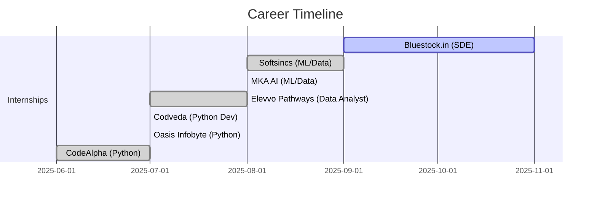

<div align="center">

<!-- Snake Animation -->
<picture>
  <source media="(prefers-color-scheme: dark)" srcset="https://raw.githubusercontent.com/platane/snk/output/github-contribution-grid-snake-dark.svg" />
  <source media="(prefers-color-scheme: light)" srcset="https://raw.githubusercontent.com/platane/snk/output/github-contribution-grid-snake.svg" />
  
</picture>

<br><br>

# Hi 👋, I'm Ahmad


<br>

[](https://ahmadleo-tech.github.io/New_portfolio/)
[](https://docs.google.com/document/d/1XZ1YCHhZTxDLT_UlPb1UtY9E73Cd0ctaePXYOsJNGos/edit?usp=sharing)
[](https://linkedin.com/in/ahmad0763)
[](mailto:ahmadleo498@gmail.com)

<br>


<br>

</div>

---

## 👨‍💻 About Me


```yaml
name: Ahmad
location: Faisalabad, Punjab, Pakistan
education: FAST NUCES '27 (Computer Science)
current_role: SDE Intern @ Bluestock.in
experience:
  - Software Development Engineer
  - ML/Data Engineer
  - Backend Developer
  
interests:
  - Backend Development
  - Data Engineering
  - AI Assistants
  - Natural Language Processing

achievements:
  - 2× National Hackathon Winner
  - IIT Kanpur TechFest Top 10
  - 25+ Projects Completed
  - 6 Successful Internships

learning_roadmap:
  - Apache Airflow
  - PySpark
  - AWS Cloud Services
```

<br clear="right"/>

---

## 🛠️ Tech Stack

<div align="center">

### 💻 Languages & Frameworks


### 🌐 Backend & APIs


### 📊 Data Science & ML


### 🗄️ Databases


### 🛠️ Tools & Platforms


</div>

---

## 🚀 Featured Projects

<div align="center">

<table>
<tr>
<td width="50%">

### 🪐 [AstroHub](https://github.com/ck-ahmad/AstroHub)


Astronomy hub with interactive content and resources for space enthusiasts

⭐ **Features:** Interactive UI, Educational Content, Knowledge Base

</td>
<td width="50%">

### 🧠 [AI Assistant 2.0](https://github.com/ck-ahmad/AI-Assistant)


Smart personal assistant powered by AI with voice recognition & NLP

⭐ **Features:** Voice Commands, Task Management, AI Integration

</td>
</tr>

<tr>
<td width="50%">

### 🎵 [Galaxify](https://github.com/ck-ahmad/Galaxify)


Spotify-style music platform with modern UI/UX

⭐ **Features:** Music Streaming, Responsive Design, Modern Interface

</td>
<td width="50%">

### 📊 [Carbon Emission Tracker](https://github.com/ck-ahmad/Carbon_Tracker)


🏆 **$100 Prize Winner** - Track & analyze carbon footprints

⭐ **Features:** Real-time Insights, AI Analysis, Sustainability Focus

</td>
</tr>

<tr>
<td width="50%">

### 📚 [Student Assistant](https://github.com/Ahmadleo-tech/Student-Assistant-Helper-)


AI-powered academic helper with intelligent search & summarization

⭐ **Features:** Academic Search, AI Summarization, Study Tools

</td>
<td width="50%">

### ⏳ Going Onn


🔄 **In Development** - Upcoming innovative web app

⭐ **Status:** Active Development | Stay Tuned!

</td>
</tr>
</table>

</div>

---

## 🧰 GitHub Statistics

<div align="center">


<br><br>


<br><br>


</div>

---

## 🏆 Hackathon Achievements

<div align="center">

<table>
<tr>
<td align="center" width="33%">

<br><br>
<b>🌍 Carbon Emission Tracker</b>
<br><br>
<sub><b>Bay2BayHacks 2025</b></sub>
<br>
<sub>Flask + OpenAI + MongoDB</sub>
<br><br>

</td>

<td align="center" width="33%">

<br><br>
<b>🧮 Derives Manager</b>
<br><br>
<sub><b>AEI Hackathon</b></sub>
<br>
<sub>Python + AI + Voice Recognition</sub>
<br><br>

</td>

<td align="center" width="33%">

<br><br>
<b>🤖 Tony AI</b>
<br><br>
<sub><b>IIT Kanpur TechFest</b></sub>
<br>
<sub>Python + NLP + Automation</sub>
<br><br>

</td>
</tr>
</table>

</div>

---

## 💼 Professional Experience

<div align="center">



</div>

<br>

<details open>
<summary><b>🔹 Current Position</b></summary>
<br>

### 💼 Bluestock.in - Software Development Engineer Intern
**📅 Oct 2025 – Present**

```diff
+ Backend & API Development (Flask, Node.js)
+ Frontend Enhancements & UI/UX Optimization
+ Problem-Solving & System Performance Improvements
+ Cross-functional Team Collaboration
+ Real-world Finance + Technology Solutions
```

</details>

<details>
<summary><b>🔹 Previous Roles</b></summary>
<br>

### 🔬 Softsincs - ML/Data Engineer
**📅 Aug – Oct 2025 (2 months)**
- 📊 Designed scalable data pipelines
- 🤖 Applied ML models (KNN, SVM, Naive Bayes)
- 🕷️ Web scraping (Requests, BeautifulSoup, JSON)
- 🚀 Delivered production-ready ML workflows

---

### 🧠 MKA AI - ML/Data Engineer
**📅 Aug 2025 (1 month)**
- 🧹 Data cleaning & preprocessing with NumPy & Pandas
- 📊 Exploratory Data Analysis (EDA) & feature engineering
- 🎯 Model training & optimization with Scikit-learn

---

### 📈 Elevvo Pathways - Data Analyst Intern
**📅 Jul – Aug 2025 (2 months)**
- 📊 Built interactive dashboards with Python & SQL
- 🤖 Automated reporting workflows
- 📈 Customer behavior & trend analysis

---

### 🐍 Python Development Internships
**📅 Jun – Jul 2025 (~2 months)**

**Oasis Infobyte | Codveda Technologies | CodeAlpha**
- 🛠️ Developed Flask apps, CLI tools, automation scripts
- 🔌 Built APIs & voice-based AI chatbot
- 🎯 Applied OOP, DSA, debugging, API integration
- 🎮 **Key Projects:** Hangman Game, Stock Portfolio Tracker, AI Chatbot

</details>

---

## 🔧 Personal Projects Journey

<div align="center">

### 🎨 Project Categories

<table>
<tr>
<td align="center" width="25%">

<br><br>
<b>Backend Development</b>
<br>
<sub>Jun 2025 – Present</sub>
<br>
<sub>5 months</sub>
</td>
<td align="center" width="25%">

<br><br>
<b>Python Developer</b>
<br>
<sub>Jun 2024 – Jul 2025</sub>
<br>
<sub>1 yr 2 mos</sub>
</td>
<td align="center" width="25%">

<br><br>
<b>Learning by Building</b>
<br>
<sub>Jun 2024 – Jun 2025</sub>
<br>
<sub>1 yr 1 mo</sub>
</td>
<td align="center" width="25%">

<br><br>
<b>Hackathon Projects</b>
<br>
<sub>2024 – 2025</sub>
<br>
<sub>3 Wins</sub>
</td>
</tr>
</table>

</div>

<details open>
<summary><b>🌐 Backend Development Projects</b></summary>
<br>

| Icon | Project | Description |
|:----:|---------|-------------|
| 🌐 | **Portfolio** | Personal website showcasing skills & journey |
| 🪐 | **AstroHub** | Astronomy hub with interactive content |
| 🌌 | **Galaxify** | Spotify-style music platform |
| 🧠 | **AI Assistant 2.0** | Smart AI-powered productivity assistant |
| 📚 | **Student AI Assistant 2.0** | Enhanced academic companion |
| 📝 | **AI Note Generator & API** | Intelligent note generation system |
| 🌦️ | **Weather API** | Real-time weather data service |
| 🔗 | **Offline Translator API** | Local translation without internet |
| ⏳ | **Going Onn** | Upcoming web app (In Progress) |

</details>

<details>
<summary><b>🐍 Core Python Projects</b></summary>
<br>

| Icon | Project | Description | Tech |
|:----:|---------|-------------|------|
| 🤖 | **Tony AI 1.0** | Voice-controlled AI assistant | Core Python, OOP, pyttsx3 |
| 📚 | **Student Assistant 1.0** | Academic helper tool | Python, Core AI |
| 📁 | **Drive Manager** | Local file organizer | Python, OOP |

**Libraries Mastered:**
- `pyttsx3` - Text-to-speech
- `speech_recognition` - Voice commands
- `pyowm` - Weather updates
- `googletrans` - Translation
- `datetime`, `os`, `json` - Core utilities

</details>

<details>
<summary><b>🎮 Learning Projects (Python & C++)</b></summary>
<br>

| Icon | Project | Type | Tech |
|:----:|---------|------|------|
| 📊 | **Pokec Social Network** | Data Analysis | Python, Pandas, NumPy |
| 🐱 | **Nyan Cat Game** | Game | C++ OOP |
| 📁 | **Google Drive Manager** | Utility | C++ DSA |
| 🧩 | **Sudoku Game** | Puzzle | C++ |
| 🌐 | **Basic Translator** | Tool | Python APIs |

</details>

---

## 📚 Learning Roadmap

<div align="center">

### 🛣️ My Journey

```
2023 ━━━━━━━━━━ 🎓 C++ & Web Basics
                    ████████░░ 80%

2024 ━━━━━━━━━━ 🐍 Python, AI & Games
                    ██████████ 95%

2025 ━━━━━━━━━━ 💼 Internships & ML
                    ███████░░░ 70%

2026 ━━━━━━━━━━ ☁️ Data Engineering
                    ███░░░░░░░ 30%
```

<br>

### 🎯 Current Focus

<table>
<tr>
<td align="center" width="33%">

<br><br>
<b>Apache Airflow</b>
<br>

</td>
<td align="center" width="33%">

<br><br>
<b>PySpark</b>
<br>

</td>
<td align="center" width="33%">

<br><br>
<b>AWS Cloud</b>
<br>

</td>
</tr>
</table>

</div>

---

## ⚡ Fun Facts

<div align="center">

<table>
<tr>
<td align="center" width="33%">

<br><br>
<b>AI Enthusiast</b>
<br>
<sub>Love solving real-world<br>problems with AI 🤖</sub>
</td>
<td align="center" width="33%">

<br><br>
<b>Project Builder</b>
<br>
<sub>Built 25+ projects from<br>AI assistants to games 🎮</sub>
</td>
<td align="center" width="33%">

<br><br>
<b>Hackathon Lover</b>
<br>
<sub>Hackathon adrenaline ><br>Coffee ☕</sub>
</td>
</tr>
</table>

</div>

---

## 🏅 Achievements

<div align="center">

| 🏆 Achievement | 📅 Date | 💡 Details |
|:--------------|:--------|:-----------|
| 🥇 **Bay2BayHacks Winner** | 2025 | $100 Prize for Carbon Tracker |
| 🥉 **AEI Hackathon 3rd Place** | 2024 | Derives Manager Project |
| 🔟 **IIT Kanpur TechFest Top 10** | 2024 | Tony AI Assistant |
| 🎓 **Multiple Certifications** | 2024-25 | SQL, NumPy, Data Analysis, Python |

</div>

---

## 🤝 Let's Connect

<div align="center">

### 📬 Reach Out

<a href="mailto:ahmadleo498@gmail.com">
  
</a>
<a href="https://linkedin.com/in/ahmad0763">
  
</a>
<a href="https://github.com/ck-ahmad">
  
</a>
<a href="https://ahmadleo-tech.github.io/New_portfolio/">
  
</a>

<br><br>

### 💼 Open to Collaboration

<table>
<tr>
<td align="center" width="25%">

<br><br>
<b>Backend Development</b>
<br>
<sub>Flask, Node.js, APIs</sub>
</td>
<td align="center" width="25%">

<br><br>
<b>Data Engineering</b>
<br>
<sub>Pipelines, ETL, Analytics</sub>
</td>
<td align="center" width="25%">

<br><br>
<b>AI/ML Projects</b>
<br>
<sub>NLP, Gemini, Automation</sub>
</td>
<td align="center" width="25%">

<br><br>
<b>Open Source</b>
<br>
<sub>Contributing & Learning</sub>
</td>
</tr>
</table>

<br>

### 🎯 What I'm Looking For

<table>
<tr>
<td align="center">

<br>
<b>Full-time SDE or<br>Data Engineering roles</b>
</td>
<td align="center">

<br>
<b>Exciting projects in<br>AI/ML, Backend, Data</b>
</td>
<td align="center">

<br>
<b>Mentorship opportunities<br>from industry experts</b>
</td>
<td align="center">

<br>
<b>Hackathon teammates for<br>competitive coding</b>
</td>
<td align="center">

<br>
<b>Collaborative learning<br>& knowledge sharing</b>
</td>
</tr>
</table>

<br>

### 📫 Response Time

| Platform | Response Time | Status |
|:---------|:--------------|:-------|
| 💌 **Email** | < 24 hours | ✅ Active |
| 💼 **LinkedIn** | Daily | ✅ Active |
| 🐱 **GitHub** | Regular | ✅ Active |

</div>

---

<div align="center">


<br>


<br><br>

### ⭐ If you like my work, feel free to star my repositories!

<br>

<sub>🚀 From [ck-ahmad](https://github.com/ck-ahmad) | Built with 💙 Python, ☕ Coffee & endless curiosity</sub><br>
<sub>📍 Faisalabad, Punjab, Pakistan | 🎓 FAST NUCES '27 | Last updated: November 2025</sub>

<br>


</div>
